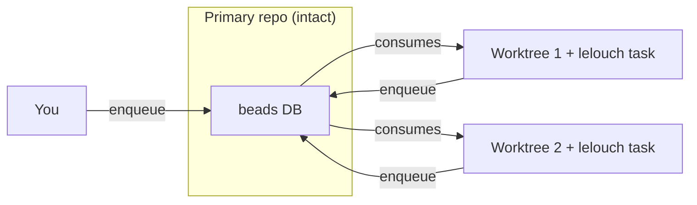

# Example Workflow with Git Worktrees

## Use Case

This workflow works well for the user where they have some deferred execution
tasks they want to execute in a workflow. For example, waiting half an hour for
CI to complete before running the next stage.

## Requirements

- lelouch (this project)
- beads (https://github.com/steveyegge/beads)

## Concept

The high-level idea is:

1. You keep your primary interactive repository intact.
2. You create one or more [Git Worktrees](https://git-scm.com/docs/git-worktree)
   which can be used by your agents.
3. In the primary repo, initialize your beads database.
4. In the worktrees, you also initialize your beads database, with the same worktree.
5. Initialize lelouch in each repository (which will allow lelouch to track each job in it's own task)
6. start lelouch
7. enqueue work as you see fit via beads or lelouch.
8. your agents will also enqueue new work into beads or lelouch as needed.

As a visual, it looks like:




## Setup

1. Create one or more worktrees with `git worktree add {repo}`:

```
git worktree add ../repo-for-agent
```

2. Initialize your database (I like to use stealth mode):

```
bd init --stealth
```

3. In each *worktree*, initialize lelouch:

**note** add a pre-prompt to ensure that the agent will reset your environment to your desired state before picking up the next task.

```
cd ../repo-for-agent
lelouch init . --executor=cursor-agent --pre-prompt="run `git checkout -B repo-for-agent origin/develop` before running the task"
```