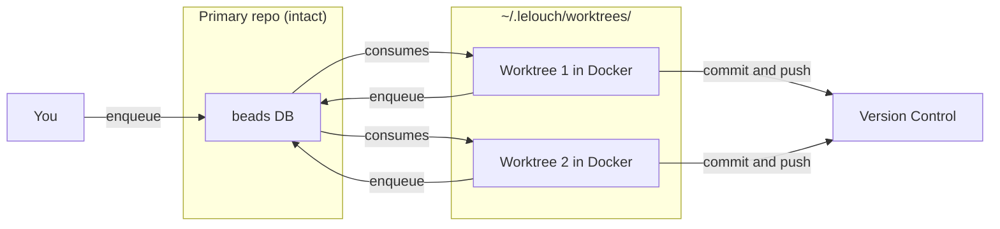

# Dynamic Worktree Workflow

## Use Case

This workflow works well for users who have deferred execution tasks they want to execute in a seamless workflow. For example, waiting half an hour for CI to complete before running the next stage.

## Requirements

- lelouch (this project)
- beads (https://github.com/steveyegge/beads)
- Docker (for launching executors in isolated containers)

## Concept

The high-level idea is:

1. You keep your primary interactive repository intact.
2. `lelouch` actively orchestrates one or more dynamic [Git Worktrees](https://git-scm.com/docs/git-worktree) which are used by your agents.
3. In the primary repo, you initialize your beads database and define the max worker count for `lelouch`.
4. Start `lelouch` in daemon mode.
5. Enqueue work as you see fit via beads or lelouch. `lelouch` will automatically assign tasks to isolated Docker containers running mapped worktrees from `~/.lelouch/worktrees`.

As a visual, it looks like:



## Setup

1. Initialize your database in your primary repo (stealth mode is recommended):

```
bd init --stealth
```

2. Initialize lelouch in your primary repo, configuring the number of maximum workers:

**note** you can add an optional pre-prompt and custom dockerfile flag if necessary.

```
lelouch init . --executor=cursor-agent --max-workers=2
```

3. Start the daemon which will provision the worktrees and automatically dispatch tasks using Docker containers for isolation:

```
lelouch run
```
